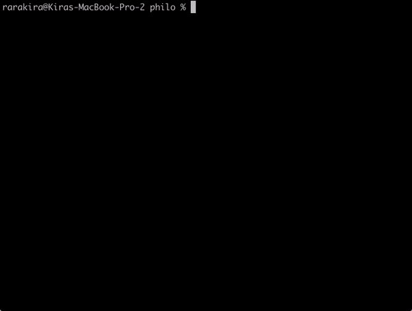
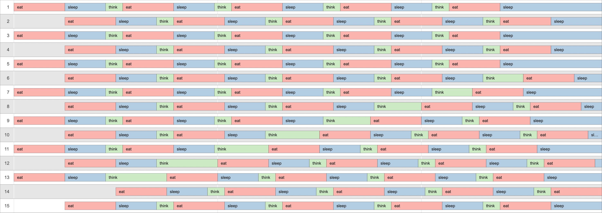

_This is a **21 School/Ecole 42** Project_

# 🍴Philo
Philo is a program that visualises dining philosophers with status logs in terminal. In computer science, the dining philosophers problem is an example problem often used to illustrate synchronisation issues and techniques for resolving them.

## Project goals

* Introducing the problem of deadlock
* Understand the difference between threads and processes
* Learn about mutexes and semaphores


## Rules

* One or more philosophers sit at a round table. There is a large bowl of spaghetti in the middle of the table.
* The philosophers alternatively `eat`, `think`, or `sleep`. _While they are eating, they are not thinking nor sleeping; while thinking, they are not eating nor sleeping; and, of course, while sleeping, they are not eating nor thinking._
* There are also forks on the table. There are as many forks as philosophers.
* Each philosopher needs to hold two forks simultaneously to eat.
* When a philosopher has finished eating, they put their forks back on the table and start sleeping. Once awake, they start thinking again.
* The simulation stops when a philosopher dies of starvation.
* Philosophers don’t speak with each other.
* Philosophers don’t know if another philosopher is about to die.
* No need to say that philosophers should avoid dying!

### Main program `philo` folder
* Each philosopher is a thread.
* A fork lies between each philosopher.
* Each fork is a mutex.

### Bonus program `philo_bonus` folder
* Each philosopher is a process.
* All forks lie at the center of the table.
* Forks are represented by semaphores.

## To compile and run
Run the following commands in Terminal:
```shell
# to build
> make

# to run
> ./philo 21 800 200 100 10
```



### Program arguments

`number_of_philosophers`: The number of philosophers and also the number of forks.

`time_to_die (in milliseconds)`: If a philosopher didn’t start eating time_to_die milliseconds <ins>since the beginning</ins> of their last meal or the beginning of the simulation, they die.

`time_to_eat (in milliseconds)`: The time it takes for a philosopher to eat. During that time, they will need to hold two forks.

`time_to_sleep (in milliseconds)`: The time a philosopher will spend sleeping.

_`[number_of_times_each_philosopher_must_eat]`_ (optional argument): If all philosophers have eaten at least number_of_times_each_philosopher_must_eat times, the simulation stops. If not specified, the simulation stops when a philosopher dies.

### Visualisation for `./philo 15 800 250 200 5`



## Useful links

* Philosophers [visualiser](https://nafuka11.github.io/philosophers-visualizer/)
